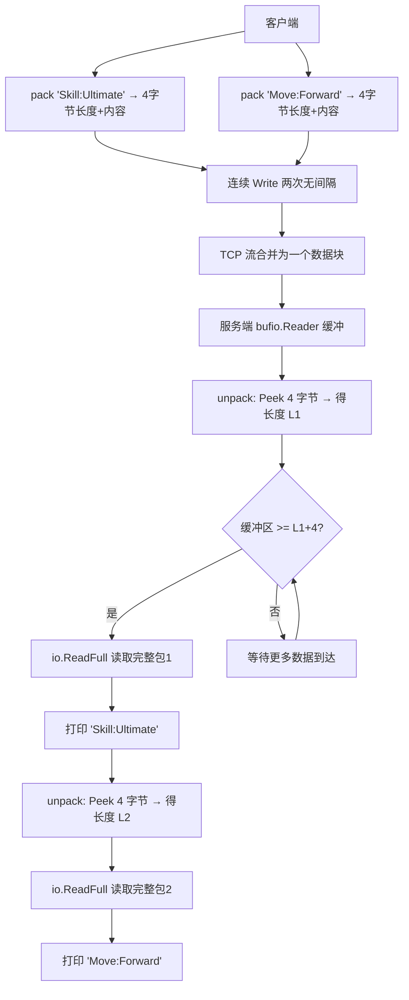

# Packet Fix — TCP 粘包拆解

> **核心目标**：通过自定义「长度前缀」协议，解决 TCP 流式传输中的粘包问题，确保每个消息独立解析。

---

## 📌 知识点归纳

| # | 概念 | 关键代码 | 一句话说明 |
|---|------|----------|-----------|
| 1 | **粘包成因** | 连续 `conn.Write()` 两次中间无间隔 | TCP 是流式协议，无消息边界，多次写入的数据可能被合并到一个缓冲区 |
| 2 | **封包（Pack）** | `binary.Write(pkg, binary.BigEndian, length)` + 内容 | 在每个消息前加 4 字节大端序长度头，构成 `[长度|内容]` 帧 |
| 3 | **窥探（Peek）** | `reader.Peek(4)` | 读取前 4 字节但不消耗，用于提前获取长度再决定读多少 |
| 4 | **缓冲区就绪判断** | `reader.Buffered() < length+4` | 数据没攒够一个完整包时暂不处理，等待下次再试 |
| 5 | **精确读取** | `io.ReadFull(reader, pack)` | 一次性读取指定字节数，防止数据残留在缓冲区 |
| 6 | **大端序** | `binary.BigEndian` | 网络传输标准字节序，高字节在前，与 `htonl` 同义 |

---

## 🧪 运行方式

```bash
cd day53/packet_fix && go run .
```

---

## 🔄 执行流程



## 💡 协议图解

```
包1: [0x00 0x00 0x00 0x0E | S k i l l : U l t i m a t e]
       ↑ 4字节大端长度=14   ↑ 14字节消息体

包2: [0x00 0x00 0x00 0x0C | M o v e : F o r w a r d]
       ↑ 4字节大端长度=12   ↑ 12字节消息体

粘包后 TCP 缓冲区:
[0x00 0x00 0x00 0x0E S k i l l : U l t i m a t e 0x00 0x00 0x00 0x0C M o v e : F o r w a r d]
                                                     ↑ 第二个包的头紧接第一个包的尾
```
