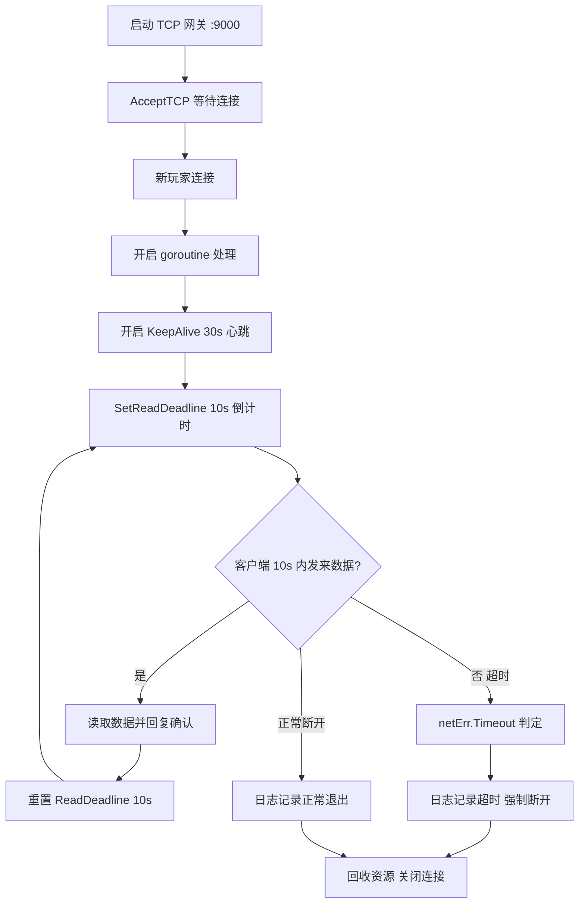

# TCP Hardener — TCP 连接加固

> **核心目标**：利用底层 Socket 控制，加固 TCP 长连接，防御僵尸连接和慢连接攻击。

---

## 📌 知识点归纳

| # | 概念 | 关键代码 | 一句话说明 |
|---|------|----------|-----------|
| 1 | **底层监听** | `net.ResolveTCPAddr` + `net.ListenTCP` | 获得 `*net.TCPConn` 类型，解锁 Socket 级别的精细控制 |
| 2 | **接收连接** | `listener.AcceptTCP()` | 阻塞等待客户端连接并返回 `*net.TCPConn` |
| 3 | **KeepAlive 保活** | `conn.SetKeepAlive(true)` + `conn.SetKeepAlivePeriod(30s)` | 底层定期发送心跳包，检测异常断电/断网导致的僵尸连接 |
| 4 | **Read Deadline** | `conn.SetReadDeadline(time.Now().Add(10s))` | 每次读取前刷新超时，防御"慢连接攻击"，防止死连接霸占文件描述符 |
| 5 | **超时判断** | `if netErr, ok := err.(net.Error); ok && netErr.Timeout()` | 区分超时断开与客户端主动断开，便于日志区分 |
| 6 | **租约续期** | 每次收到消息 → 回复确认 → 重置 10s Deadline | 活跃连接持续获得有效期延长，沉默自动剔除 |

---

## 🧪 运行方式

```bash
cd day53/tcp_hardener && go run .

# 另开终端测试
nc 127.0.0.1 9000
# 输入任意文字观察"租约续期"效果
# 保持 10 秒不输入观察超时断开
```

---

## 🔄 执行流程


